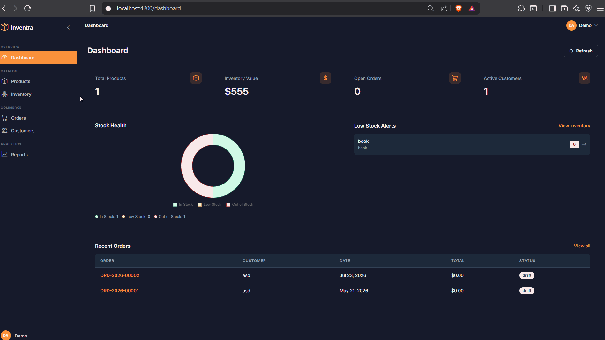

# Inventra

[](https://github.com/isomer04/inventra/actions/workflows/ci.yml)
[](LICENSE)
[](backend/pom.xml)
[](backend/pom.xml)
[](frontend/package.json)

## 🎬 Demo



A multi-tenant inventory and order management SaaS built to production-readiness standards. Spring Boot 4 API + Angular 21 SPA, containerised with Docker Compose for both local development and production.

> Built as a portfolio project to demonstrate full-stack architecture, security hardening, and operational readiness — not just "it works on my machine."

## 🚀 Quick Start

### Prerequisites

- Docker & Docker Compose (recommended)
- Java 25 + Maven 3.9+ (for backend local dev)
- Node.js 22.12+ + npm 11+ (for frontend local dev)

### Running with Docker Compose

1. Create a `.env` file and fill in `JWT_SECRET`:

   ```bash
   cp .env.example .env
   openssl rand -base64 64   # generate a strong secret
   ```

2. Start the stack:

   ```bash
   docker compose up
   ```

   > `docker-compose.yml` runs MySQL + the API. Start the Angular dev server separately with `cd frontend && npm start` (see [Development](#️-development)).

3. Access the application:

   | Service | URL |
   |---------|-----|
   | API | http://localhost:8081 |
   | Swagger UI | http://localhost:8081/swagger-ui.html |
   | Health check | http://localhost:8081/actuator/health |
   | Frontend dev server | http://localhost:4200 (run via `npm start`) |

4. Sign in with the seeded demo account (dev profile only):

   ```
   Email:    admin@demo.com
   Password: demo1234
   ```

### Production

```bash
docker compose -f docker-compose.prod.yml up -d
```

The production stack serves the Angular SPA via nginx on port `80`, keeps MySQL and the API on the internal Docker network, and fails fast on any missing required env var. See `.env.example` for the full list.

## 🏗️ Architecture

### Tech Stack

**Backend**
- Spring Boot 4.1.0 on Java 25
- Spring Security + JWT (`io.jsonwebtoken` 0.13.x)
- Spring Data JPA + MySQL 8.4
- Flyway for schema migrations
- MapStruct for DTO mapping
- SpringDoc OpenAPI for API docs
- JUnit 5 + Testcontainers for integration tests
- JaCoCo for coverage, PITest for mutation testing

**Frontend**
- Angular 21 (standalone components, new control-flow syntax)
- Bootstrap 5 + Bootstrap Icons
- Chart.js / ng2-charts for reports
- Vitest via `@angular/build:unit-test` for unit tests

**Infra**
- Docker Compose (dev + prod profiles)
- nginx as the production reverse proxy with hardened security headers
- GitHub Actions CI (build, test, SAST, SCA, Docker smoke test)

### Features

- Multi-tenant architecture — each tenant's data is isolated via `tenant_id` enforced at the service layer
- JWT authentication with refresh-token rotation (15-min access tokens, 7-day refresh)
- Role-based access control: `ADMIN`, `MANAGER`, `WAREHOUSE_STAFF`, `VIEWER`
- Full order lifecycle: `DRAFT → SUBMITTED → APPROVED/REJECTED → PICKING → SHIPPED → DELIVERED`
- Inventory management with typed stock movements (receipt, adjustment, reserve, release, ship)
- Reporting endpoints: inventory summary, stock movements, order summary, top products
- Audit log for user lifecycle, order transitions, and tenant registration
- GDPR right-to-erasure endpoint (`DELETE /api/v1/tenant`)

## 🔐 Authentication

```bash
# Register a new tenant
POST /api/v1/auth/register
{
  "tenantName": "Acme Corp",
  "slug": "acme",
  "email": "admin@acme.com",
  "password": "password123",
  "firstName": "John",
  "lastName": "Doe"
}

# Login
POST /api/v1/auth/login
{ "email": "admin@acme.com", "password": "password123" }

# Use the token
Authorization: Bearer <accessToken>
```

Full API reference is available via Swagger UI at `/swagger-ui.html` — all endpoints, request/response shapes, and role requirements are documented there.

## 🧪 Testing

```bash
# Backend — unit + integration tests (Testcontainers spins up MySQL automatically)
cd backend && mvn test

# Backend — mutation testing on critical-tier services (≥80% threshold)
cd backend && mvn test -P mutation-test

# Frontend
cd frontend && npm test
```

**Coverage:** 208 tests across unit (JwtService, OrderService, AuthService, StockMovementService, and more), integration (schema + constraint verification via Testcontainers), API boundary, and frontend accessibility tests.

## 🛠️ Development

```bash
# Backend
cd backend
mvn clean package          # build
mvn spring-boot:run        # run locally (requires MySQL)
mvn test                   # run tests
mvn spotbugs:check         # SAST
mvn -P security-scan verify  # OWASP dependency scan

# Frontend
cd frontend
npm install
npm start                  # dev server at http://localhost:4200
npm run build:prod         # production build
```

## 🔒 Security

Key security hardening includes:

- JWT `iss`/`aud` claims enforced on parse; startup guard rejects weak secrets
- Refresh tokens hashed with SHA-256 before storage; rotated on every use
- All 39 `getTenantId()` calls replaced with `requireTenantId()` — fails loudly if called without tenant context
- `@PreAuthorize` on every controller method — access policy visible in code, not just config
- Input validation: `@Size` constraints on all free-text fields, body size capped at 2MB at both Spring and nginx layers
- JSON output HTML-escapes `<`, `>`, `&`, `'` via custom `JacksonConfig`
- nginx: CSP, HSTS with `preload`, `X-Content-Type-Options`, `Referrer-Policy`, `Permissions-Policy`
- Docker base images pinned to SHA-256 digests
- OWASP Dependency-Check + SpotBugs + Find Security Bugs in CI (fails on CVSS ≥ 7 / Medium+)
- DB privilege separation: Flyway runs as a DDL user; the app runs as a DML-only user

## 💾 Backups

```bash
./scripts/backup.sh        # gzipped, timestamped dump
./scripts/restore.sh /var/backups/inventra/inventra-20260101T000000Z.sql.gz
```

Passwords are passed via `MYSQL_PWD` env var (not the `-p` flag) to avoid leaking through `ps`. Default retention: 14 days.

## 🏛️ Architecture Decisions

All 40 architecture decisions are recorded in [`docs/adr/`](docs/adr/) using the Michael Nygard ADR format.
See the [Decision Index](docs/adr/README.md) for the full catalogue, grouped by backend, frontend,
and build/quality/infrastructure.

## 📝 License

Released under the [MIT License](LICENSE). Feel free to fork, adapt, and build on it.
